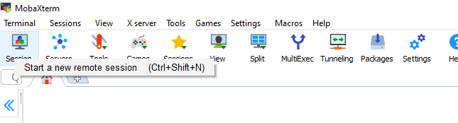

# SSH

Click on the link to the operating system you are using

[SSH on Linux](#sshlinux)

[SSH on Mac](#sshmac)

[SSH on Windows](#sshwindows)

# SSH on Linux<a name="sshlinux"></a>

**Note:** Instructions are provided for **Ubuntu**, but if you are running a 
different flavour of linux, the only thing that should be different is how to 
open the terminal. From step 3 onwards, everything should be identical.

1) On Ubuntu, click on the icon in the top left of the screen

2) Type *Terminal*  and open the terminal application


3) Into the Linux terminal that appears, type `ssh username@servername`, 
   replacing username and servername with the username and server name that you 
   have been emailed:

```bash
ssh bt007@bt007.genomicscourse.com
```

1) The first time you log in, you will see a message talking about the host's
   authenticity, it's fingerprint and asksing if you wish to continue.

```
The authenticity of host 'bt007.genomicscourse.com (192.135.232.24)' can't be established.
ECDSA key fingerprint is SHA256:xmvrB9Ke/bXNtpu5PXF6IbUS8wxCtF6SNqZ7VV+IRoU.
Are you sure you want to continue connecting (yes/no)?
```

This message is normal when you log in to a new server. Agreeing will store the server's fingerprint, and the message will not appear again.

1) Type `yes` into the Linux terminal and hit return.

2) You will then be asked for a password.

```
bt007@bt007.genomicscourse.com's password:
```

Type in the password that you've been emailed, and hit return. Nothing will appear while you type. If you know you have made a mistake, you can hold down backspace, and retype the password.

7) Congratulations! You are now logged in!

# SSH on Mac<a name="sshmac"></a>

1) Press Cmd-Space to open Spotlight, type *Terminal*, and press enter.


2) Into the Mac terminal that appears, type `ssh username@servername`, replacing username and servername with the username and server name that you have been emailed:

```
ssh bt007@bt007.genomicscourse.com
```

3) The first time you log in, you will see a message talking about the host's authenticity, it's fingerprint and asksing if you wish to continue.

```
The authenticity of host 'bt007.genomicscourse.com (192.135.232.24)' can't be established.
ECDSA key fingerprint is SHA256:xmvrB9Ke/bXNtpu5PXF6IbUS8wxCtF6SNqZ7VV+IRoU.
Are you sure you want to continue connecting (yes/no)?
```

This message is normal when you log in to a new server. Agreeing will store the server's fingerprint, and the message will not appear again.


4) Type `yes` into the Mac terminal and press enter.


5) You will then be asked for a password.

```
bt007@bt007.genomicscourse.com's password:
```

Type in the password that you've been emailed, and hit return. Nothing will appear while you type. If you know you have made a mistake, you can hold down backspace, and retype the password.

6) Congratulations! You are now logged in!


# SSH on Windows<a name="sshwindows"></a>

## Installing MobaXTerm

There are a number of SSH clients you can use, but for the purposes of this practical, we would recommend MobaXTerm.

1) Download MobaXTerm from:
<https://mobaxterm.mobatek.net/download-home-edition.html> - select installer version.

2) Unzip the folder you downloaded.

3) Run the file ending in .msi - you'll get a windows prompt to install this, which it is safe to agree to. Install MobaXTerm in the default location, and you're then ready to log in.

## Logging in through MobaXTerm

1) Open MobaXTerm from the Windows start menu (if you can't find it, use the search bar).

2) Click on Session in the upper left of MobaXTerm 

3) Select SSH in the window that opens.

4) In the next window, enter your computer's hostname in the `Remote host` box
   (your computer's hostname is included in the email that we sent you with log 
   in details).

5) In the same window, tick the `Specify username` box, and add your username 
   (included in the email that we sent you with log in details).


1) Tick OK, at the bottom of the box.

2) You may see a message the first time you log in, saying that "the authenticity of the host can not be established", and asking if you wish to continue connecting. This message is normal when you log in to a new server. Agreeing will store the server's fingerprint, and the message will not appear again.

3) Click on `Yes` if the message appears


9) You will then be asked for a password.

```
james@james.genomicscourse.com's password:
```

Type in the password that you've been emailed, and press enter. Nothing will appear while you type. If you know you have made a mistake, you can hold down backspace, and retype the password.

10) Congratulations! You are now logged in!
