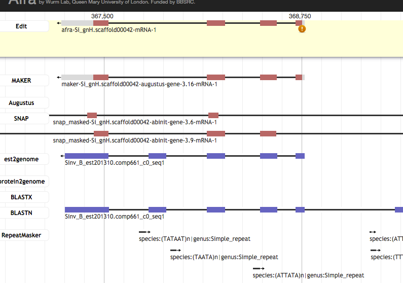
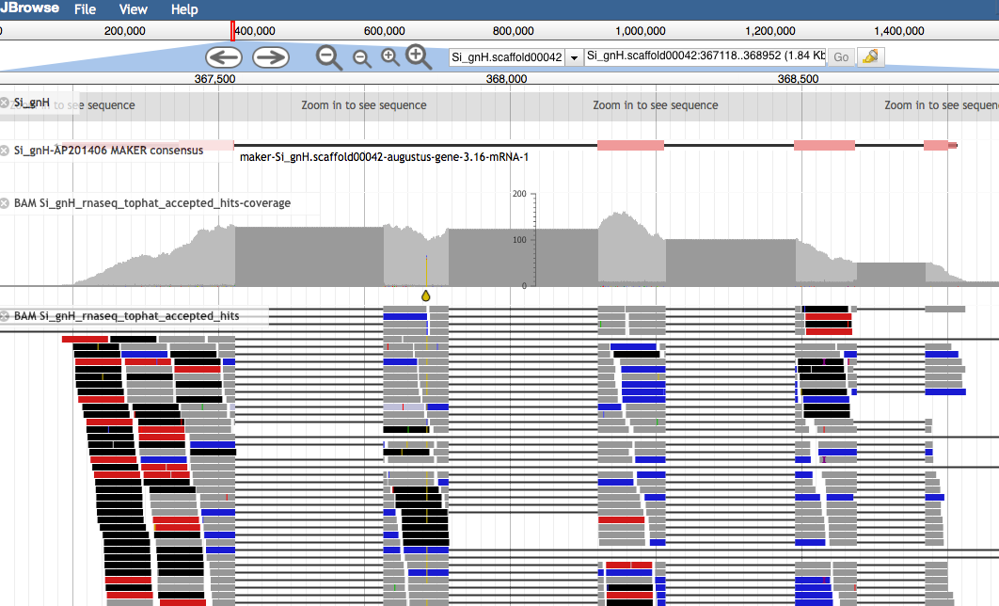
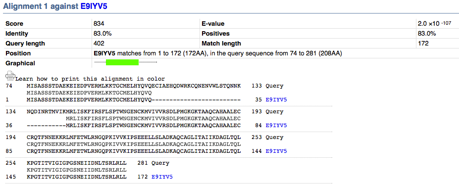
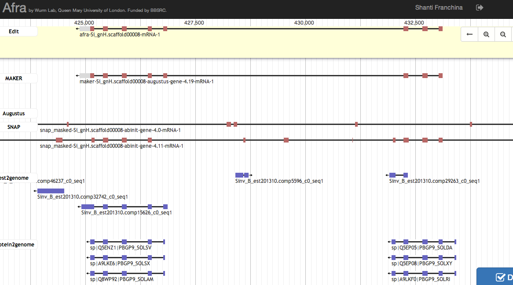
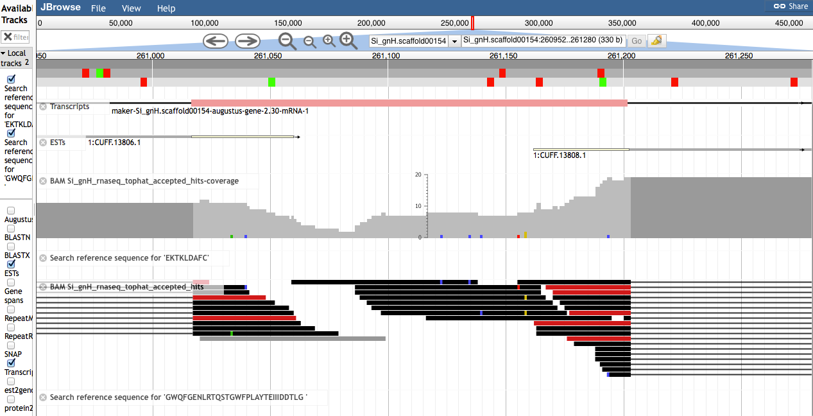
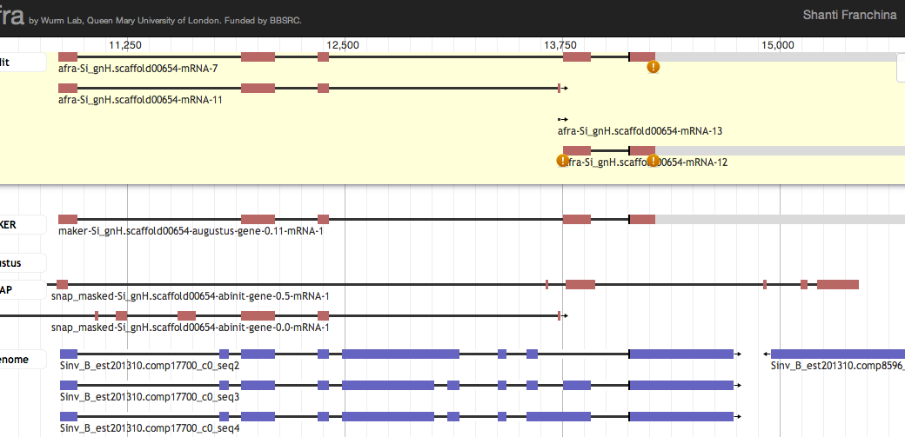

## MSc Bioinformatics
### Gene predictions

<a href="//bmpvieira.com/annotation14" target="_blank">bmpvieira.com/annotation14</a>

Bruno Vieira | <i class="fa fa-twitter"></i> <a href="//twitter.com/bmpvieira" target="_blank">@bmpvieira</a>  
Elena Shanti Franchina

---

### Why is this important?

Genes are the basic building block of organisms

---

### How?

<small>
Gene prediction models
 <a href="//dx.doi.org/10.1016/j.gene.2010.04.008" target="_blank">(Sleator, 2010)</a>
</small>

---

<section data-background="img/MAKER.jpg"></section>

---

<section data-background="img/afra-demo-tutorial.png"></section>

---

<section data-background="img/afra-demo-editing.mov.gif"></section>

---

<section data-background="img/afra-demo-tutorial-highlight.png"></section>

---

### WebApollo -> Afra

<i class="fa fa-github-alt"></i> <a href="//github.com/gmod/apollo" target="_blank">gmod/apollo</a>
→
<i class="fa fa-github-alt"></i> <a href="//github.com/yeban/afra" target="_blank">yeban/afra</a>

 

 Anurag Priyam | <i class="fa fa-twitter"></i> <a href="//twitter.com/yeban" target="_blank">@yeban</a>

---

### BLAST

* [Understanding BLAST Output](http://mcclintock.generationcp.org/index.php?option=com_content&task=view&id=27&Itemid=46)
* [Example-Driven Web-Based BLAST Tutorial](http://www.ncbi.nlm.nih.gov/books/NBK1734/)

---

### Missing Exon

---

### Missing Exon

---

### Missing Exon

---

### Extra Exon

---

### Split

---

### Split

---

### Split

---

### Practical

* [Afra Login](http://afra.sbcs.qmul.ac.uk/#login)
* [Task](http://afra.sbcs.qmul.ac.uk/curate?id=4980)
* [Cookbook](https://docs.google.com/document/d/1unZua1wysrTmVtpTM9rUptKrmkkhcxV4s6YYP3mz0NM/edit?usp=sharing)
